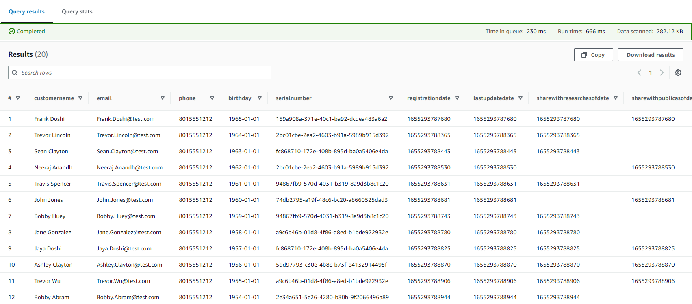
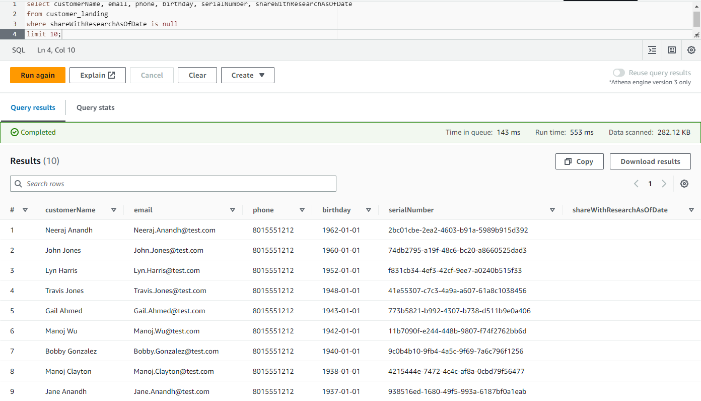

# Data Lake Project
> Using AWS Glue, AWS S3, Python, and Spark, create or generate Python scripts to build a lakehouse solution in AWS that satisfies these requirements from the STEDI data scientists.

## Table of Contents
* [Landing Zone](#landing-zone)
* [Trusted Zone](#trusted-zone)

## Landing Zone
Query Landing Zone Data

### customer landing data

### accelerometer landing data

## Trusted Zone

### customers with no public research allowing shown in landing zone

### customers with no public research allowing are not shown in trusted zone

