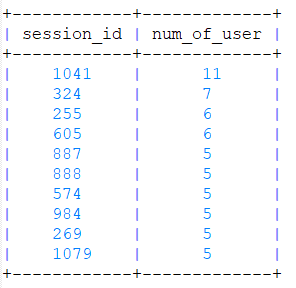

# DWH Project
> Build an simple ETL with Redshift in Dataware House

## Table of Contents
* [Create Tables](#create-tables)
* [ETL](#etl)
* [Sample Queries](#sample-queries)

## Create Tables
Create staging tables and analyzing tables, drop all tables if they are existed
$ python create_tables.py 

## ETL
Extract json data from S3 into staging tables. Afterwards, continue to extract data from staging tables, then transform data and load them into analyzing tables
$ python etl.py

## Sample Queries
Some sample queries to analyze number of user
$ python analyze.py

### query_session_with_num_of_user

### query_on_song_artist_location

+------------------------------------------------------+--------------------------------+-----------------+-------------+
|                      song_title                      |          artist_name           |     location    | num_of_user |
+------------------------------------------------------+--------------------------------+-----------------+-------------+
|                    You're The One                    |         Dwight Yoakam          |  Pikeville, KY  |      37     |
|                 I CAN'T GET STARTED                  |           Ron Carter           |   Ferndale, MI  |      9      |
| Catch You Baby (Steve Pitron & Max Sanna Radio Edit) |         Lonnie Gordon          |      Nevada     |      9      |
|  Nothin' On You [feat. Bruno Mars] (Album Version)   |             B.o.B              |  Washington DC  |      8      |
|               Hey Daddy (Daddy's Home)               |             Usher              |   Atlanta, GA   |      6      |
|               Hey Daddy (Daddy's Home)               | Usher featuring Jermaine Dupri |   Atlanta, GA   |      6      |
|                     Make Her Say                     | Kid Cudi / Kanye West / Common | Cleveland, Ohio |      5      |
|                     Make Her Say                     |            Kid Cudi            | Cleveland, Ohio |      5      |
|                     Up Up & Away                     | Kid Cudi / Kanye West / Common | Cleveland, Ohio |      5      |
|                     Up Up & Away                     |            Kid Cudi            | Cleveland, Ohio |      5      |
+------------------------------------------------------+--------------------------------+-----------------+-------------+

### query_on_song_artist_latitude

+------------------------------------------------------+--------------------------------+----------+-------------+
|                      song_title                      |          artist_name           | latitude | num_of_user |
+------------------------------------------------------+--------------------------------+----------+-------------+
|                    You're The One                    |         Dwight Yoakam          | 37.4817  |      37     |
|                 I CAN'T GET STARTED                  |           Ron Carter           | 42.46066 |      9      |
| Catch You Baby (Steve Pitron & Max Sanna Radio Edit) |         Lonnie Gordon          | 38.50205 |      9      |
|  Nothin' On You [feat. Bruno Mars] (Album Version)   |             B.o.B              | 38.8991  |      8      |
|               Hey Daddy (Daddy's Home)               | Usher featuring Jermaine Dupri |   None   |      6      |
|               Hey Daddy (Daddy's Home)               |             Usher              |   None   |      6      |
|                     Make Her Say                     | Kid Cudi / Kanye West / Common | 41.50471 |      5      |
|                     Make Her Say                     |            Kid Cudi            | 41.50471 |      5      |
|                     Up Up & Away                     | Kid Cudi / Kanye West / Common | 41.50471 |      5      |
|                     Up Up & Away                     |            Kid Cudi            | 41.50471 |      5      |
+------------------------------------------------------+--------------------------------+----------+-------------+

### query_on_song_artist_location_with_female

+------------------------------------------------------+--------------------------------+-----------------+-------------+
|                      song_title                      |          artist_name           |     location    | num_of_user |
+------------------------------------------------------+--------------------------------+-----------------+-------------+
|                    You're The One                    |         Dwight Yoakam          |  Pikeville, KY  |      26     |
|                 I CAN'T GET STARTED                  |           Ron Carter           |   Ferndale, MI  |      7      |
| Catch You Baby (Steve Pitron & Max Sanna Radio Edit) |         Lonnie Gordon          |      Nevada     |      6      |
|       Supermassive Black Hole (Album Version)        |              Muse              |        UK       |      4      |
|               Hey Daddy (Daddy's Home)               | Usher featuring Jermaine Dupri |   Atlanta, GA   |      4      |
|                     Up Up & Away                     |            Kid Cudi            | Cleveland, Ohio |      4      |
|  Nothin' On You [feat. Bruno Mars] (Album Version)   |             B.o.B              |  Washington DC  |      4      |
|               Hey Daddy (Daddy's Home)               |             Usher              |   Atlanta, GA   |      4      |
|                     Up Up & Away                     | Kid Cudi / Kanye West / Common | Cleveland, Ohio |      4      |
|               Given Up (Album Version)               |          Linkin Park           | Los Angeles, CA |      3      |
+------------------------------------------------------+--------------------------------+-----------------+-------------+

### query_on_song_artist_location_with_female_paid

+------------------------------------------------------+--------------------------------+-----------------+-------------+
|                      song_title                      |          artist_name           |     location    | num_of_user |
+------------------------------------------------------+--------------------------------+-----------------+-------------+
|                    You're The One                    |         Dwight Yoakam          |  Pikeville, KY  |      22     |
|                 I CAN'T GET STARTED                  |           Ron Carter           |   Ferndale, MI  |      7      |
|       Supermassive Black Hole (Album Version)        |              Muse              |        UK       |      4      |
|  Nothin' On You [feat. Bruno Mars] (Album Version)   |             B.o.B              |  Washington DC  |      4      |
| Catch You Baby (Steve Pitron & Max Sanna Radio Edit) |         Lonnie Gordon          |      Nevada     |      4      |
|               Hey Daddy (Daddy's Home)               | Usher featuring Jermaine Dupri |   Atlanta, GA   |      3      |
|               Hey Daddy (Daddy's Home)               |             Usher              |   Atlanta, GA   |      3      |
|                Unwell (Album Version)                |        matchbox twenty         |                 |      3      |
|                      Mr. Jones                       |         Counting Crows         |                 |      3      |
|                     Make Her Say                     |            Kid Cudi            | Cleveland, Ohio |      2      |
+------------------------------------------------------+--------------------------------+-----------------+-------------+
