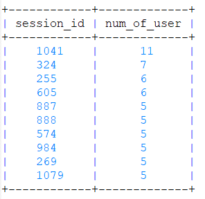
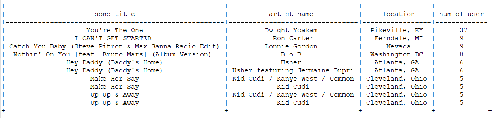
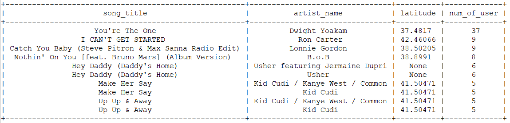
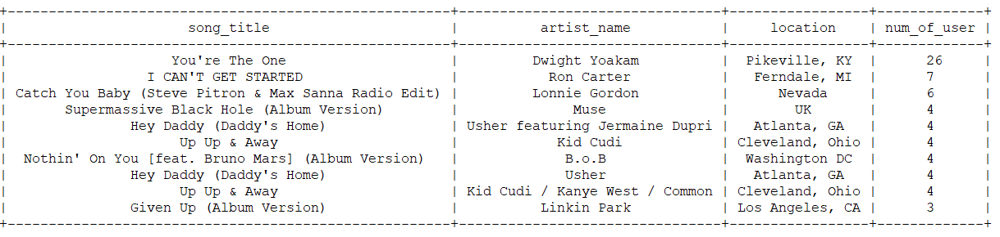
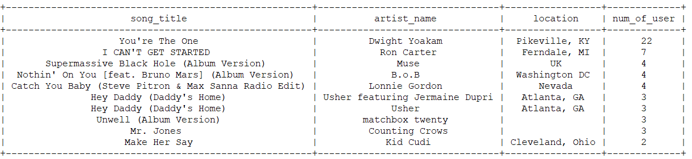

# DWH Project
> Build an simple ETL with Redshift in Dataware House

## Table of Contents
* [Create Tables](#create-tables)
* [ETL](#etl)
* [Sample Queries](#sample-queries)

## Create Tables
Create staging tables and analyzing tables in Redshift, drop all tables if they are existed
$ python create_tables.py 

## ETL
Extract json data from S3 into staging tables. Afterwards, continue to extract data from staging tables, then transform data and load them into analyzing tables
$ python etl.py

## Sample Queries
Some sample queries to analyze number of user
$ python analyze.py

### query_session_with_num_of_user

### query_on_song_artist_location

### query_on_song_artist_latitude

### query_on_song_artist_location_with_female

### query_on_song_artist_location_with_female_paid
